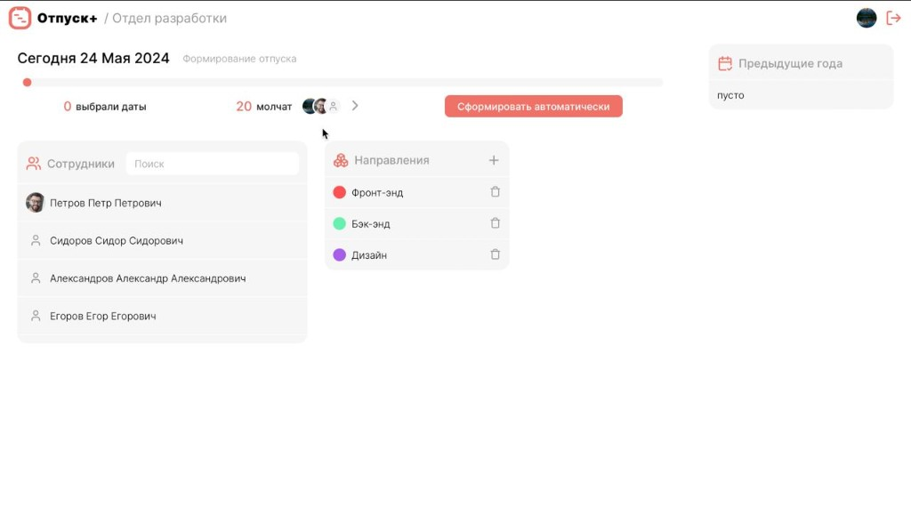
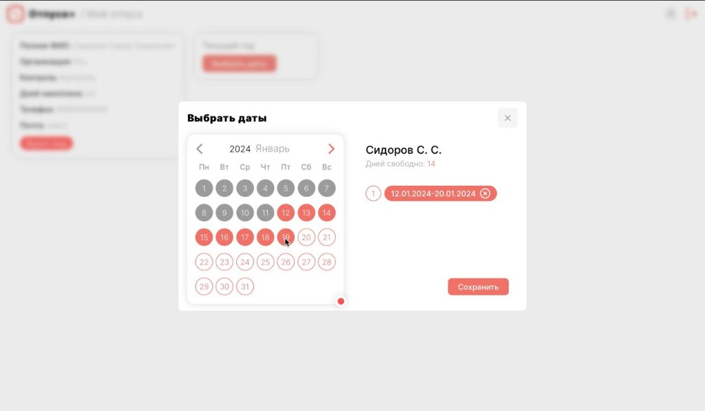
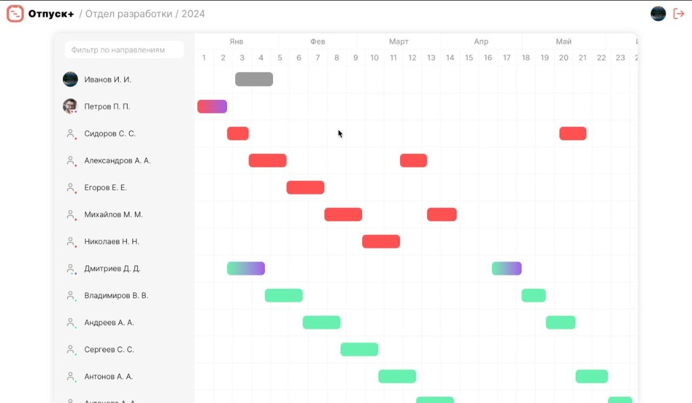

# Vacation Plus

Система управления отпусками сотрудников: календарь, диаграмма Ганта, подразделения и учёт отпускных периодов.

Монорепозиторий: React-клиент + ASP.NET Core API.

## Демо

https://github.com/DucksNotDead/vacation_plus/raw/main/docs/demo.mp4

[Скачать демо-видео](docs/demo.mp4) · ~40 сек

## Скриншоты

<p>
  
  
</p>
<p>
  
  
</p>

| Админ-панель | Выбор дат | Гантт | Сотрудник |
| --- | --- | --- | --- |
| Формирование года и подразделения | Календарь отпускных интервалов | Годовой план по сотрудникам | Профиль и направления |

## Возможности

- Роли: сотрудник и администратор
- Автоматическая генерация отпускного года с учётом пожеланий сотрудников и непрерывной работы подразделений
- Календарь и годовой план отпусков
- Диаграмма Ганта по сотрудникам
- Управление подразделениями (units) и пользователями
- Редактирование отпускных интервалов

## Стек

| Часть | Технологии |
|---|---|
| Frontend | React, TypeScript, Vite, Prismane, Framer Motion, React Router |
| Backend | ASP.NET Core, Entity Framework, SQL Server |

## Структура

```
frontend/   # React/Vite клиент
backend/    # .NET API (VacationPlusNewAPI)
docs/       # демо-видео и скриншоты
```

## Запуск

### Frontend

```bash
cd frontend
npm i
npm run dev
```

### Backend

```bash
cd backend
# проверьте ConnectionStrings в appsettings.json
dotnet restore
dotnet run
```
